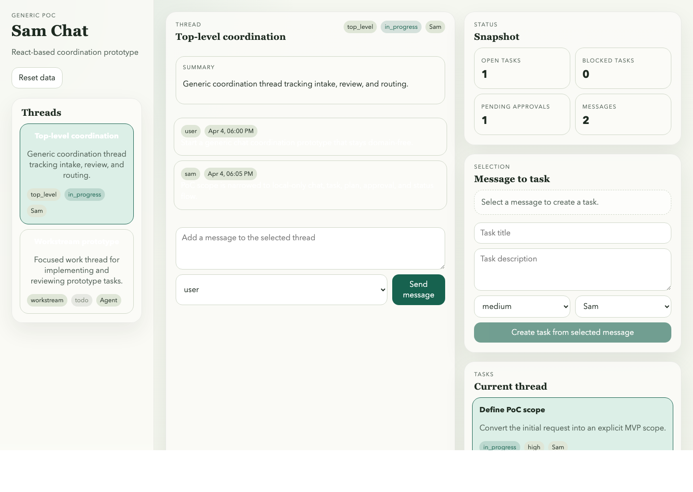

# Threaded Coordination Chat

Threaded Coordination Chat is a domain-free React prototype for structured coordination work. It combines conversation threads with manual task creation, plan tracking, approval handling, and status visibility in a lightweight local-first interface.

This repository is public-ready for prototype sharing:
- GitHub is the intended source of truth
- the app runs locally with React and Vite
- data starts from local seed JSON and persists with browser localStorage
- the current scope is intentionally single-user and local-only



## Why this exists

Many chat interfaces are good at conversation but weak at preserving operational structure. This prototype explores a simple alternative: keep the conversation visible, but let a user manually turn messages into tasks, plans, approvals, and status updates without leaving the thread.

## What this repo demonstrates

- conversation stays visible inside threads
- messages can be manually converted into tasks
- tasks can carry plans, approvals, and status
- structured operational state can live alongside chat without backend complexity

## Current MVP

- Multiple thread types for coordination and focused work
- Thread message timeline
- Message posting into the active thread
- Manual task creation from a selected message
- Task status tracking with `todo`, `in_progress`, `blocked`, `done`
- Plan items attached to a task
- Task-level approvals with `yes` and `no`
- Thread-level status snapshot
- Local-only persistence via browser localStorage

## Deliberate constraints

- Single-user only
- No authentication
- No backend
- No real-time sync
- No external API integration
- No domain-specific business logic
- No deployment workflow in this repository

## Local run

```bash
npm install
npm run dev
```

Open the local address printed by Vite, typically:

```text
http://localhost:5173
```

To validate the production build path:

```bash
npm run check
```

## Project structure

```text
sam-chat-poc/
├── README.md
├── LICENSE
├── .gitignore
├── package.json
├── index.html
├── docs/
│   ├── architecture.md
│   ├── decisions.md
│   ├── demo-assets.md
│   ├── roadmap.md
│   ├── scope.md
│   └── workflow.md
├── public/
│   └── seed.json
└── src/
    ├── app/
    ├── components/
    ├── models/
    ├── state/
    ├── main.jsx
    └── styles.css
```

## Documentation

- [Scope](./docs/scope.md)
- [Architecture](./docs/architecture.md)
- [Workflow](./docs/workflow.md)
- [Decisions](./docs/decisions.md)
- [Roadmap](./docs/roadmap.md)
- [Demo Assets Guidance](./docs/demo-assets.md)

## Demo guidance

This repository does not currently include screenshots or a hosted demo. For public presentation guidance, see [docs/demo-assets.md](./docs/demo-assets.md).

## License

This repository is prepared for publication under the MIT License. See [LICENSE](./LICENSE).

## Prototype tooling note

Prototype acceleration tools may be used during exploration, but generated outputs should be reviewed before publication. GitHub remains the source of truth for tracked evolution of this repository.
